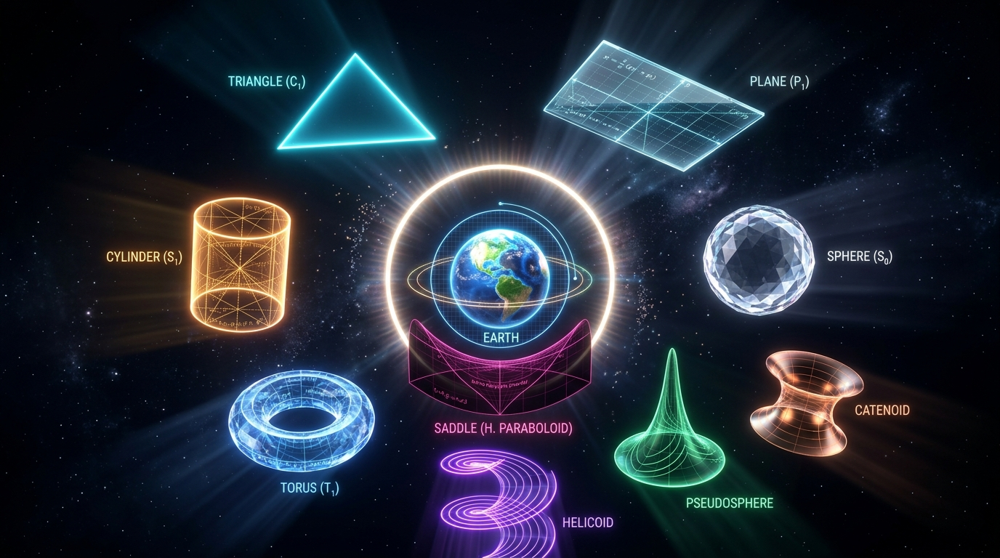

# Gauss–Riemann, Part I: Gaussian Curvature and Three Geometries

## 1. What Is Curvature?

When we think of geometry, we usually picture drawing points and lines on a flat sheet of paper and constructing shapes. This kind of geometry is called **Euclidean geometry**.

In Euclidean geometry, the three interior angles of a triangle always add up to 180 degrees. Also, through a point not on a given line, exactly one parallel line can be drawn that never meets that line.

But the space we live in is full of surfaces that are not flat. On curved surfaces — like the surface of a ball, or a saddle shape — these rules can change.

To understand this difference, we first need to understand what **curvature** is.

Curvature is a value that describes how much a line or surface bends. For example, a large circle curves gently, while a small circle curves more sharply.

The curvature of a circle with radius $R$ can be written as

$$
k=\frac{1}{R}
$$

In other words, the smaller the radius, the larger the curvature, and the larger the radius, the smaller the curvature.

For surfaces, though, things are a bit more complicated. If you look at a point on a surface, it can curve differently depending on the direction you look.

Consider a cylinder, for example. The side of a cylinder curves in the direction that goes around the circle, but it runs straight in the direction parallel to the cylinder's axis.

So at a point on a surface, there are two representative curvatures in directions perpendicular to each other. These are called the **principal curvatures**, usually written as $k_1$ and $k_2$.

Gauss used the product of these two principal curvatures to express an important property of the surface.

$$
K=k_1k_2
$$

This value is called the **Gaussian curvature**.

---

## 2. Gaussian Curvature of a Plane and a Cylinder

First, let's consider a plane.

A plane doesn't curve in any direction. So both principal curvatures are 0.

$$
k_1=0,\qquad k_2=0
$$

Therefore, the Gaussian curvature of a plane is

$$
K=0\times0=0
$$

Now let's consider a cylinder.

The surface of a cylinder curves in the direction that goes around its circumference. If the cylinder's radius is $R$, the curvature in this direction is

$$
\frac{1}{R}
$$

But in the direction parallel to the cylinder's axis, the surface runs straight. The curvature in this direction is 0.

So the two principal curvatures of a cylinder are

$$
k_1=0,\qquad k_2=\frac{1}{R}
$$

and the Gaussian curvature is

$$
K=0\times\frac{1}{R}=0
$$

What's interesting is that even though a cylinder clearly looks curved in three-dimensional space, its Gaussian curvature is exactly 0, just like a plane.

You can understand this by thinking about a sheet of paper. You can roll a sheet of paper into a cylinder without stretching or shrinking it. In this process, the distances and angles measured on the paper don't change.

So while a cylinder's overall shape is different from a plane's, the distances and angles measured on its surface are preserved in the same way as on a plane.

We can connect this kind of transformation to the idea of an **isometric deformation**, or **isometry**. The key point is that bending a surface — without stretching or compressing it — cannot change its **intrinsic** geometric structure, meaning the relationships between distances and angles that can be measured directly on the surface. We'll look at this concept of "intrinsic" more closely in the next section.

---

## 3. Gauss's Remarkable Discovery

Here Gauss made a very important discovery.

Gaussian curvature is not a value determined solely by how a surface appears to bend in three-dimensional space. It is also a property determined by the relationships between distances and angles that can be measured directly on the surface itself.

As briefly mentioned in the previous section, such a property is called **intrinsic**.

"Intrinsic" means that a property is determined solely by what can be measured on the object itself, not by its shape as seen from the outside or by its surrounding environment.

By contrast, the perspective that describes how a surface bends within the surrounding three-dimensional space is called **extrinsic**.

Gauss's discovery is known as **Gauss's Remarkable Theorem (Theorema Egregium)**, from the Latin *Theorema Egregium*.

According to this theorem, simply bending a surface — without stretching or shrinking it — cannot change its Gaussian curvature.

For example, even if you roll a flat sheet of paper into a cylinder, its Gaussian curvature remains 0. A plane and a cylinder look different on the outside, but they share the same Gaussian curvature.

On the other hand, turning a plane into a sphere can't be done by bending alone. The paper must be stretched, shrunk, or in some cases torn.

This is because a sphere's Gaussian curvature is different from a plane's.

This discovery showed that curvature is not simply about how something looks from the outside — it's tied to the geometric structure of the surface itself.

### An Intriguing Transformation: The Helicoid and the Catenoid

An example that illustrates this idea in an even more striking way is the **helicoid** and the **catenoid**.

A helicoid is a surface twisted into a spiral shape, while a catenoid is a surface that narrows in the middle, connecting two rings. On the surface, these two shapes look quite different from each other.

Yet they share something in common: both are **minimal surfaces**. A minimal surface is one whose **mean curvature** is 0.

In particular, consider the following fascinating transformation:

> "Deformation of a right-handed helicoid into a left-handed one and back again via a catenoid"

In other words, a **right-handed helicoid** continuously deforms — passing through a **catenoid** — into a **left-handed helicoid**, and then returns the other way.

Throughout this process, the surface's outward appearance changes dramatically. But this transformation raises an important question about the geometric properties of the surface.

The change in a surface's visible shape and the change in the distance-and-angle relationships measured on the surface are not the same thing.

This is exactly where it becomes important to distinguish between **extrinsic geometry** and **intrinsic geometry**.

This example of minimal surfaces also shows that mean curvature and Gaussian curvature are different concepts.

Mean curvature is defined as

$$
H=\frac{k_1+k_2}{2}
$$

while Gaussian curvature is defined as

$$
K=k_1k_2
$$

So the fact that mean curvature is 0 doesn't mean Gaussian curvature is 0 too.

---

## 4. Gaussian Curvature of a Sphere

Now let's look at a sphere.

On a sphere of radius $R$, the surface curves by the same amount in every direction. So both principal curvatures are

$$
\frac{1}{R}
$$

Therefore, the Gaussian curvature of a sphere is

$$
K=\frac{1}{R}\times\frac{1}{R}
=\frac{1}{R^2}
$$

Since the radius $R$ is always positive,

$$
K>0
$$

In other words, a sphere is a surface with **positive Gaussian curvature**.

On a sphere, the path that most directly connects two points is a bit different from a straight line on a plane. On a sphere, this kind of path is called a **geodesic**.

A sphere's geodesics are generally arcs of a **great circle** — the circle formed where a plane passing through the sphere's center intersects the sphere.

On Earth, the equator is a well-known great circle, and lines of longitude are also arcs of great circles connecting the North and South Poles.

Now let's construct a triangle on the sphere.

Consider a path that starts at the North Pole, goes down to the equator along one line of longitude, moves along the equator to the base of another line of longitude, and then returns to the North Pole along that line of longitude.

If we choose the two points on the equator appropriately, all three angles of the triangle can be 90 degrees.

Then the sum of the three interior angles is

$$
90^\circ+90^\circ+90^\circ=270^\circ
$$

While the interior angles of a planar triangle always sum to 180 degrees, on a sphere this sum can be greater than 180 degrees.

Also, because great circles on a sphere always intersect each other, you cannot draw parallel geodesics that never meet, as you can on a plane.

So a sphere, with its positive curvature, has the following features:

- Its Gaussian curvature is positive.
- The interior angles of a geodesic triangle can sum to more than 180 degrees.
- There are no parallel geodesics that never meet a given geodesic.

### Parallel Transport and Holonomy

We can understand the 90-90-90 triangle we just looked at in a different way as well.

This time, let's prepare an arrow (a vector) at the North Pole. We'll move this arrow along the same closed path as before: North Pole → down the equator along one line of longitude → along the equator to the start of another line of longitude → back to the North Pole along that line of longitude.

Moving the arrow's direction so that it changes "as little as possible" at every moment is called **parallel transport**. On a flat plane, parallel transport simply means sliding the arrow around without rotating it, so after going all the way around a closed loop and returning to the starting point, the arrow points in exactly the same direction as before.

On a sphere, however, things are different. If you parallel transport the arrow along this closed path and bring it back to the North Pole, the arrow ends up rotated exactly 90 degrees from its original direction.[^parallel-transport]

This value — how much a vector has rotated compared to its original direction after being parallel transported around a closed loop — is called **holonomy**.

Interestingly, this rotation angle (90 degrees) exactly matches the **angular excess** of the triangle we calculated earlier:

$$
270^\circ-180^\circ=90^\circ
$$

This is no coincidence. In fact, the holonomy angle along a closed loop is equal to the integral of the Gaussian curvature over the region enclosed by that loop.

$$
\text{holonomy angle}=\int_{\text{enclosed region}} K\,dA
$$

This relationship can be seen as a local version of the **Gauss-Bonnet theorem**, which we'll cover in Section 6. There, we'll extend this idea to an entire surface, and see how the integral of curvature connects to the surface's topological properties (its Euler characteristic).

In short, a triangle's angular excess, a vector's holonomy, and the integral of Gaussian curvature are all different ways of looking at the same phenomenon. The fact that a surface is curved reveals itself equally through the angles of a triangle, through the rotation of a vector carried around a loop, and through the sum of curvature values.

[^parallel-transport]: To see an illustration of parallel transport on the Earth, see: [Parallel Transport on the Earth](https://link.springer.com/chapter/10.1007/978-3-319-39799-3_5/figures/16).

---

## 5. Gaussian Curvature of a Saddle Surface

Now let's consider a surface shaped like a horse's saddle — concave in the middle and curving in different directions.

This kind of surface is called a **saddle surface**.

On a saddle surface, the surface curves upward in one direction and downward in the perpendicular direction.

So at a point, the two **principal curvatures** have opposite signs. For example, we might have

$$
k_1>0,\qquad k_2<0
$$

Then the product of the two principal curvatures — the **Gaussian curvature** — is negative.

$$
K=k_1k_2<0
$$

In other words, a saddle surface has **negative Gaussian curvature**.

This is an important contrast with the sphere.

On a sphere, both directions curve the same way, so the Gaussian curvature is positive.

On a saddle surface, the two directions curve oppositely, so the Gaussian curvature is negative.

### Saddle Surfaces and Geodesics

On a surface with negative Gaussian curvature, the properties of **geodesics** also differ from those on a plane.

A geodesic can be thought of as the path on a surface that stays as straight as possible — a **locally straight curve**.

On a plane, geodesics coincide with the straight lines we're familiar with.

On a sphere, geodesics are arcs of **great circles**, and on a general saddle surface, they take on more complicated forms.

In a space with negative curvature, geodesics tend to spread apart from one another. In particular, in the **hyperbolic plane** — an idealized space with constant negative curvature — you can draw multiple geodesics through a point not on a given geodesic that never meet that geodesic.

This is one of the key features of **hyperbolic geometry**.

In hyperbolic geometry, through a point not on a given line, there can be more than one — in fact, infinitely many — parallel lines that never meet that line.

Also, in a triangle on the hyperbolic plane, the sum of the three interior angles is less than

$$
180^\circ
$$

So we can summarize the idealized relationship between the sign of curvature and geometry as follows:

| Surface or Space | Gaussian Curvature | Sum of Interior Angles of a Geodesic Triangle | Parallel Geodesics |
| --- | --- | --- | --- |
| Plane | $K=0$ | 180° | Exactly one |
| Sphere | $K>0$ | Greater than 180° | None |
| Negatively curved space | $K<0$ | Less than 180° | Many |

There's one important caveat here.

Not every saddle surface is a complete hyperbolic plane. A saddle surface is generally just one type of surface with negative Gaussian curvature, while the hyperbolic plane is a special geometric space with constant negative curvature.

So while saddle surfaces can exhibit properties related to hyperbolic geometry, we shouldn't assume that "every saddle surface = the hyperbolic plane."

### Saddle Surfaces and Minimal Surfaces

The helicoid we looked at earlier is also a representative example of a saddle-shaped surface.

The helicoid is a classic example of a **minimal surface**. On a minimal surface, the mean curvature is

$$
H=\frac{k_1+k_2}{2}=0
$$

So

$$
k_1+k_2=0
$$

and therefore

$$
k_2=-k_1
$$

Then the Gaussian curvature is

$$
K=k_1k_2
=-k_1^2
\leq0
$$

In other words, at regular points of a minimal surface, the Gaussian curvature is negative or zero.

The fact that both the helicoid and the catenoid are minimal surfaces nicely illustrates that mean curvature and Gaussian curvature carry different information.

Mean curvature is related to the **sum** of the two principal curvatures,

$$
H=\frac{k_1+k_2}{2}
$$

while Gaussian curvature is related to their **product**.

$$
K=k_1k_2
$$

So the fact that mean curvature is 0 doesn't let us conclude that Gaussian curvature is also 0.

In this way, a saddle surface is not just an amusing shape with a dip in the middle — it's a striking example where several important geometric concepts meet: negative Gaussian curvature, geodesics, hyperbolic geometry, and minimal surfaces.

---

## 6. How Does Gaussian Curvature Relate to an Entire Surface?

The Gaussian curvature we've examined so far is a **local property**, defined at a single point on a surface.

So what happens if we add up this curvature over an entire surface?

The theorem that answers this question is the **Gauss-Bonnet theorem**. Recall from Section 4 that on a sphere, the holonomy — the rotation angle produced by parallel transporting a vector around a closed loop — equals the integral of curvature over the region enclosed by that loop. The Gauss-Bonnet theorem can be seen as extending this idea to an entire surface: a closed surface with no boundary enclosing itself.

$$
\int_S K\,dA=2\pi\chi(S)
$$

The left-hand side is the sum of the Gaussian curvature over the entire surface.

Here, $K$ is the Gaussian curvature at each point, and $dA$ represents an infinitesimally small area element of the surface.

The $\chi(S)$ on the right-hand side is called the **Euler characteristic**.

The Euler characteristic is a value that describes the overall topological structure of a surface — it's related to whether the surface has holes or handles.

If we divide a closed surface into a collection of small faces, the Euler characteristic can be defined as

$$
\chi=V-E+F
$$

Here, $V$ is the number of vertices, $E$ is the number of edges, and $F$ is the number of faces.

That is, you divide the surface into small pieces, then subtract the number of edges from the number of vertices and add the number of faces.

The important point is that no matter how you divide it, **for a closed surface with no holes or handles, like a sphere, this value is always 2**.

So the Euler characteristic of a sphere is

$$
\chi(S)=2
$$

Applying the Gauss-Bonnet theorem to a sphere, the right-hand side becomes

$$
2\pi\chi(S)
=
2\pi\times2
=
4\pi
$$

Meanwhile, on a sphere of radius $R$, the Gaussian curvature at every point is

$$
K=\frac{1}{R^2}
$$

and the total surface area of the sphere is

$$
4\pi R^2
$$

So summing the Gaussian curvature over the entire sphere gives

$$
\int_S K\,dA
=
\frac{1}{R^2}\times4\pi R^2
=
4\pi
$$

Both sides of the Gauss-Bonnet theorem come out to $4\pi$.

This means that even if the sphere's size — its radius — changes, the integral of the total curvature stays the same.

### What Happens with a Torus?

Now let's consider a donut-shaped surface: the **torus**.

The Euler characteristic of a torus is

$$
\chi=0
$$

So by the Gauss-Bonnet theorem,

$$
\int_S K\,dA
=
2\pi\times0
=
0
$$

This doesn't mean the Gaussian curvature is 0 at every point on the torus, though.

On the outer part of a torus, the curvature is generally positive, while on the inner part, it's generally negative.

When you add up these curvatures over the entire surface, they cancel each other out, resulting in a total of 0.

In this way, Gaussian curvature is a **local property** defined at a single point, but when integrated over an entire surface, it connects to that surface's overall **topology**.

This is a beautiful result that shows how deeply geometry and topology are connected.

---

## 7. From Gauss to Riemann

Gauss's discovery fundamentally changed how we understand the geometry of surfaces.

In particular, it showed that what matters isn't how a surface looks from the outside, but how distances and angles can be measured on the surface itself.

This idea would later be extended to spaces of higher dimensions.

In 1854, the mathematician **Bernhard Riemann** presented a new, more general perspective on the geometry of space in his habilitation lecture at the University of Göttingen (the lecture itself was formally published posthumously in 1867).

Riemann conceived of a way to define distance and curvature not just in the familiar three-dimensional space, but in general spaces of any number of dimensions.

The field that developed from this is called **Riemannian geometry**.

In Riemannian geometry, a structure for measuring distance and direction is defined at every point in a space, and curvature is studied based on that structure.

If Gaussian curvature on a surface represents the intrinsic curvature of a two-dimensional space, Riemannian geometry generalizes this to higher-dimensional **manifolds**.

In this process, curvature may no longer be expressible as a single number.

On a general Riemannian manifold, curvature can vary depending on direction, and to express this systematically, we use the **Riemann curvature tensor**.

These geometric methods would later play a crucial role in understanding Albert Einstein's **general theory of relativity**.

In general relativity, gravity is not simply viewed as a force that pulls objects together.

Instead, mass and energy influence the geometric structure of **spacetime**, and objects and light follow the most natural path available within that curved spacetime.

Of course, the geometry used in general relativity — **Lorentzian geometry**, which treats time and space together — differs from ordinary Riemannian geometry.

But the core perspective of understanding distance, curvature, and the structure of space geometrically traces directly back to the work of Gauss and Riemann.

---

## 8. Conclusion

Today we've explored **Gaussian curvature**, a measure of how a surface bends.

On a plane, both principal curvatures are 0, so the Gaussian curvature is also 0.

A cylinder looks curved in three-dimensional space, but because the curvature in one direction is 0, its Gaussian curvature is also 0.

On a sphere, both directions curve the same way, so the Gaussian curvature is positive.

On a saddle surface, on the other hand, the two directions curve oppositely, so the Gaussian curvature is negative.

These three cases each reveal a different geometric world:

- On a **plane**, Gaussian curvature is 0, and we get **Euclidean geometry**.
- On a **sphere**, Gaussian curvature is positive, and we get **spherical geometry**.
- In a **negatively curved space**, Gaussian curvature is negative, and properties related to **hyperbolic geometry** appear.

Gaussian curvature isn't simply a value describing how curved a surface appears in three-dimensional space.

It's an important property of **intrinsic geometry**, determined by the relationships between distances and angles that can be measured on the surface itself.

And as the transformation between the helicoid and the catenoid shows us, there are fascinating cases where we must distinguish between a surface's outward appearance and its own intrinsic geometric structure.

The **Gauss-Bonnet theorem** further shows that when we integrate curvature — defined at a single point — over an entire surface, it connects to the **Euler characteristic**, a value that describes the surface's overall topological structure.

In the end, Gaussian curvature begins as a concept tied to a small piece of a surface, but it extends all the way to the geometry and topology of the entire surface — and, further still, to how we understand space and gravity themselves.

The perspective Gauss discovered takes us beyond the question "What does space look like?" and toward a deeper question:

**"If we measure distances, measure angles, and follow the straightest possible paths within a space, what kind of geometry emerges?"**

And it's from this very question that Gauss's surface geometry leads to Riemann's theory of manifolds, and from there, to the geometry of spacetime in modern physics.
